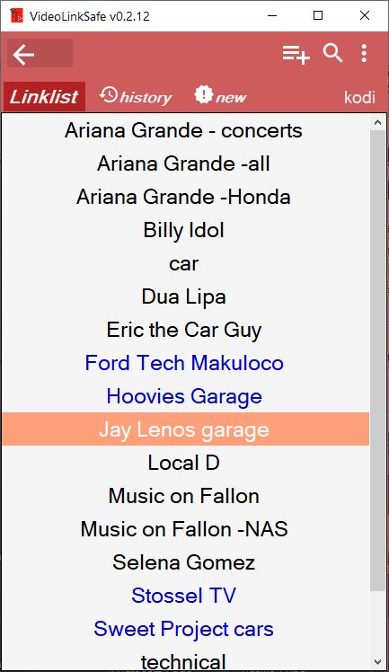
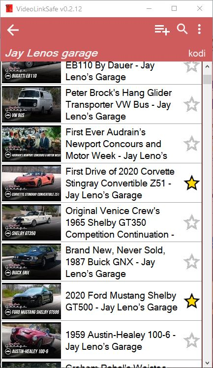

# Video Link Safe

Save and organize your YouTube links and playlists and local video files in a SQL database.  
Import for NewPipe Database file. Export the database in NewPipe, unzip the file on Windows and import it. 
Beta version for download.
  
With Kodi video playlist Import/Export function. Hotkey for link import, Youtube playlists import possible.  
Needs youtube-dl to play high resolution videos with vlc.  Drag&Drop support for local video files with thumbnail image generation. 

 
 
 
### Install

- copy all files in one directory, SQL Lite file will be created during first run.
 
### Prerequisites

- **Windows with .NET Framework 4.8** 
- VLC player nice to have.
- [youtube-dl](https://github.com/ytdl-org/youtube-dl/releases) to play high-res videos with vlc and for playlist import.  

 
## License

This project is licensed under the GPL 3 License - see the [LICENSE](LICENSE) file for details

## Acknowledgments

* the youtube-dl team
* vlc player

Thank you for your great work!
 
 

