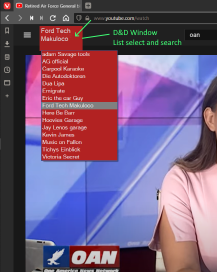
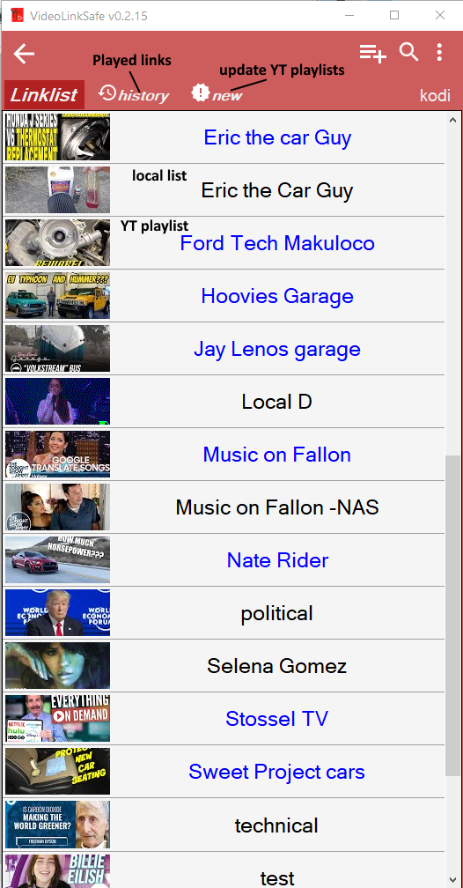
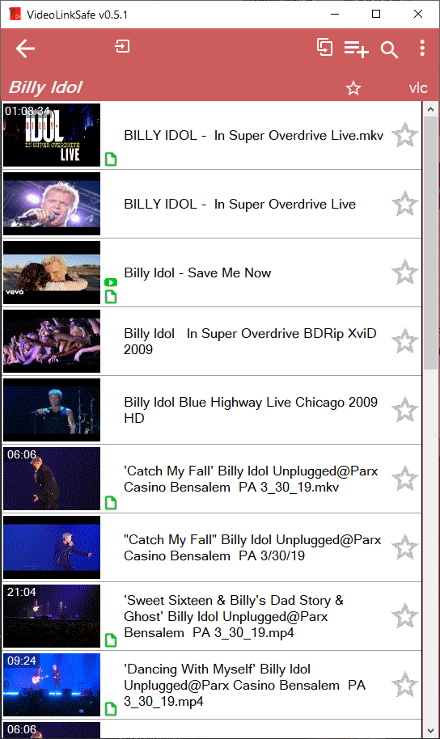

# Video Link Safe

Save and organize your Websites, Video links, local files or web based in a SQL database. Play links in VLC, webbrowser or Kodi device. Im-/Export of Kodi playlist files 
Import of NewPipe Database file. Export the database in NewPipe, unzip the file on Windows and import it. 

1.0  
Final release, next version based on .NET6    <a href=https://github.com/Isayso/VideoLinks>VideoLinks</a> 

0.7  
faster startup, Thumbnails get updated automatically, send text to Kodi function 

0.6.9
fix for Youtube slowdown of vlc playback and download

0.6.8  
Odysee/Lbry support, New Hotkey to send clipboard content direct to Kodi device with autoqueue
## Features

### Youtube:  
- Save: links, playlist  
- Play: Browser, vlc, Kodi

### Rumble:
- Save: links  
- Play: Browser, Kodi 
- Addon: <a href=https://github.com/OnePlayHD/OneRepo>OneRepo</a>  

### Odysee/Lbry:
- Save: links  
- Play: Browser, Kodi  

### Vimeo:
- Save: links  
- Play: Browser, Kodi  

### Bitchute:  
- Save: links  
- Play: Browser, Kodi
- Addon: <a href=https://github.com/winsomehax/plugin.video.bitchute>winsomehax</a>   

### Video Files:    
- Save: Files, folders d&d  
- Play: vlc, Kodi from nfs:NAS  

### html:  
- Save: links  
- Play: Browser  
    
    
  
   
  
With Kodi video playlist Import/Export function. Hotkey for link import, Youtube playlists import possible.  
Needs youtube-dl to play high resolution videos with vlc.  Drag&Drop support for local video files with thumbnail image generation. 

  
   
   
### Install

- Execute .msi file, you will be ask for a SQL Lite file name and location. 

### Quickstart

- add new List
- open it
- drag and drop local video files on list or youtube browser links on import window.

If you copy a YouTube playlist link, you will be asked for a new Listname. This list (blue) will be updated with the "new" button.
 
### Prerequisites

- **Windows with .NET Framework 4.8** 
- VLC player nice to have.
- uses compiled exe of <a href=http://ffmpeg.org>FFmpeg</a> licensed under the <a href=http://www.gnu.org/licenses/old-licenses/lgpl-2.1.html>LGPLv2.1</a> and its source can be downloaded <a href=https://github.com/FFmpeg/FFmpeg>here</a>.

 
## License

This project is licensed under the GPL 3 License - see the [LICENSE](LICENSE) file for details

## Acknowledgments

* Tyrrrz for YoutubeExplode 
* vlc player

Thank you for your great work!
 
 

