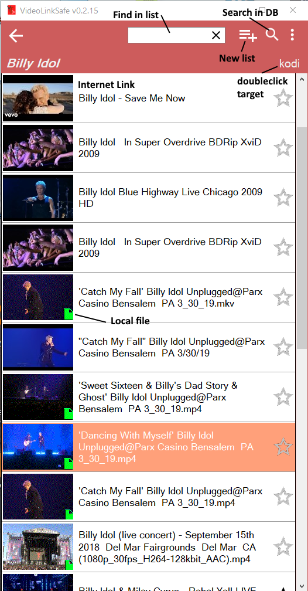

# Video Link Safe

Save and organize your Video links, local or YouTube in a SQL database. Im-/Export of Kodi playlist files 
Import of NewPipe Database file. Export the database in NewPipe, unzip the file on Windows and import it. 
Beta version of .msi installer avaliable.
  
NEW 0.32: Switch to YoutubeExplode with big performance increase! No youtube-dl necessary, ffmpeg included.

New version 0.3.1 lots of bug fixes. But after code cleanup, probably some new errors ;)

NEW: Drag & Drop of links from browser, download of video links, + CTRL plays directly in Kodi

   
  
With Kodi video playlist Import/Export function. Hotkey for link import, Youtube playlists import possible.  
Needs youtube-dl to play high resolution videos with vlc.  Drag&Drop support for local video files with thumbnail image generation. 

  
   
   
### Install

- Execute .msi file, you will be ask for a SQL Lite file name and location. 

### Quickstart

- add new List
- open it
- drag and drop local video files on list or youtube browser links on import window.

If you copy a YouTube playlist link, you will be asked for a new Listname. This list (blue) will be updated with the "new" button.
 
### Prerequisites

- **Windows with .NET Framework 4.8** 
- VLC player nice to have.

 
## License

This project is licensed under the GPL 3 License - see the [LICENSE](LICENSE) file for details

## Acknowledgments

* Tyrrrz for YoutubeExplode 
* vlc player

Thank you for your great work!
 
 

